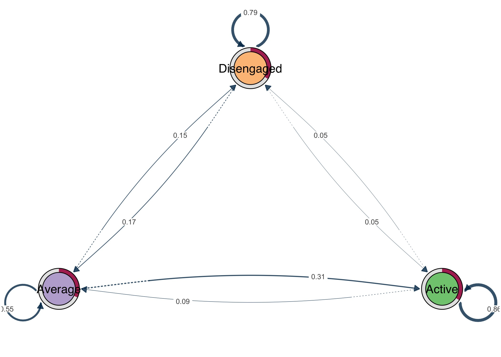
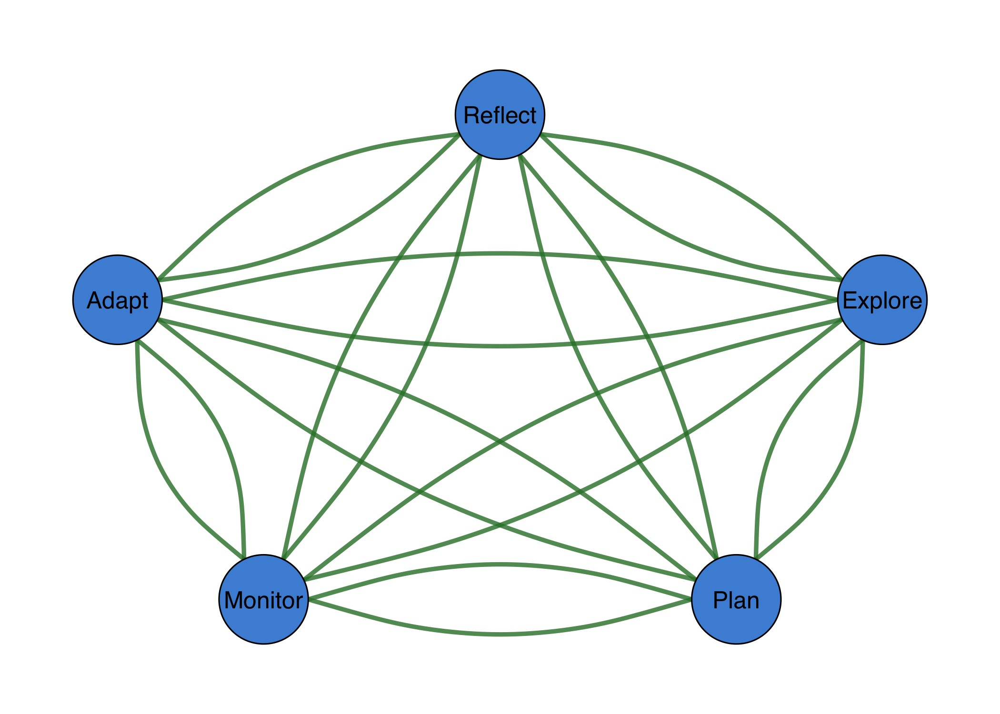
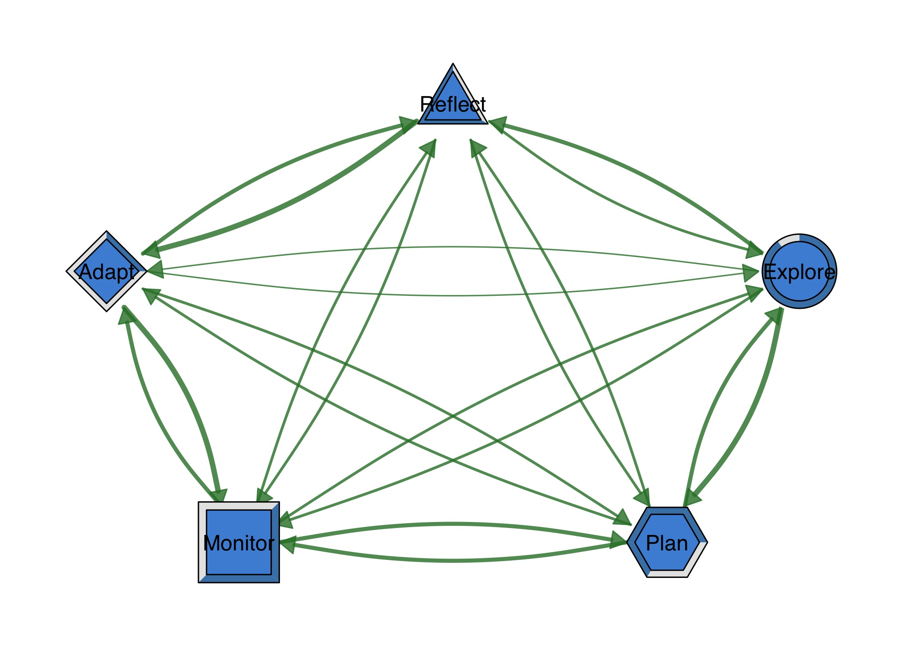
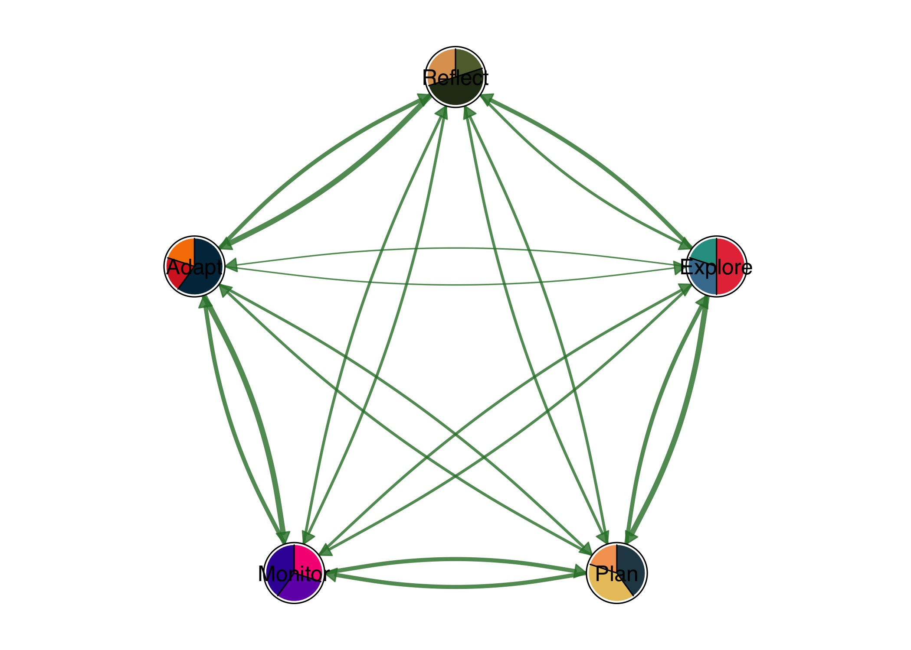
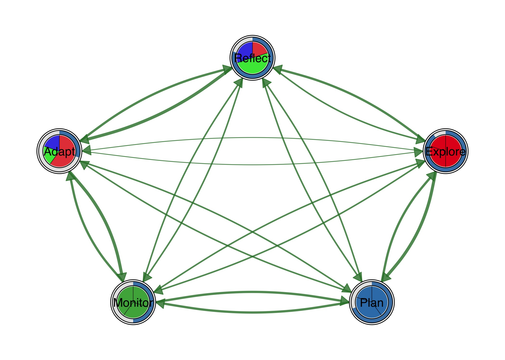
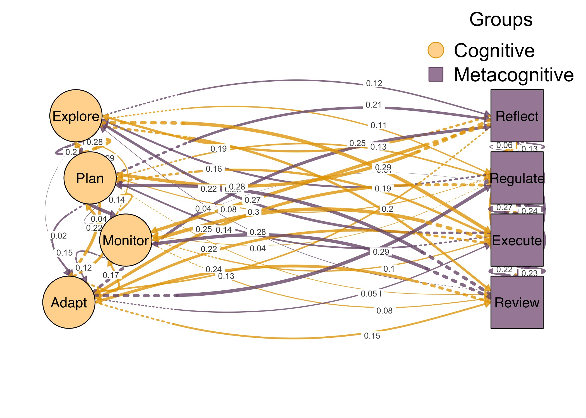
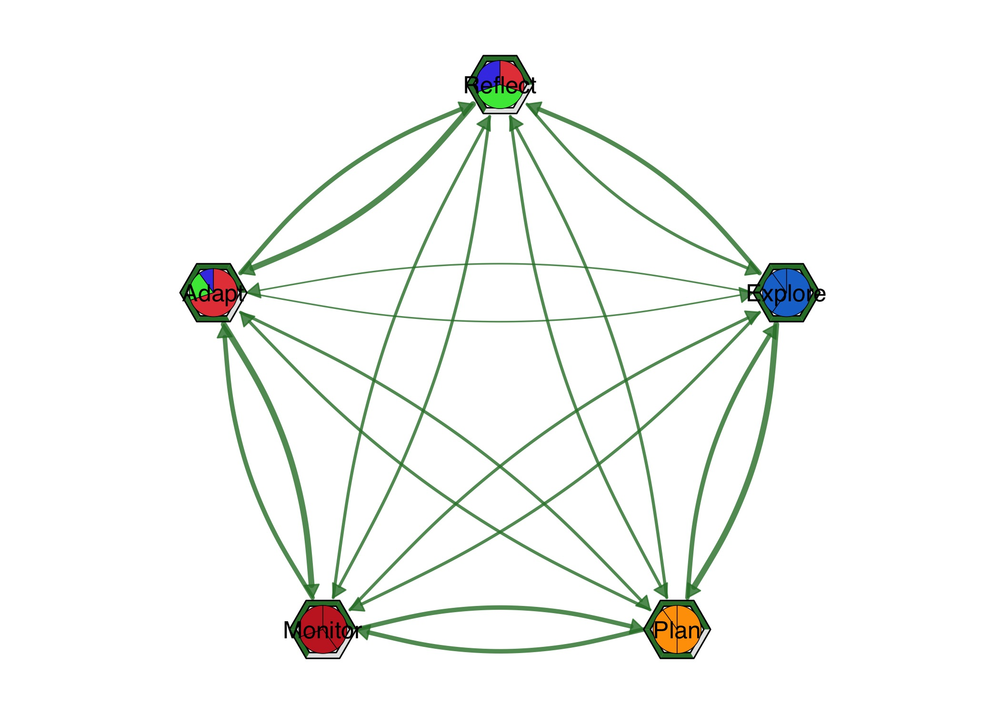

# cograph 

<!-- badges: start -->

[](https://www.repostatus.org/#active)
[](https://github.com/sonsoleslp/cograph/actions/workflows/R-CMD-check.yaml)
[](https://CRAN.R-project.org/package=cograph)
[](https://codecov.io/gh/sonsoleslp/cograph)
[](https://opensource.org/licenses/MIT)
<!-- badges: end -->

**cograph** is a modern R package for network visualization with rich
node styling, multiple layouts, and first-class support for Transition
Network Analysis (TNA).

## Installation

``` r
# Install from CRAN (when available)
install.packages("cograph")

# Development version from GitHub
devtools::install_github("sonsoleslp/cograph")
```

## TNA Plot

The primary use case: visualize transition networks from the `tna`
package.

``` r
library(tna)
library(cograph)

# Build a TNA model from sequence data
fit <- tna(engagement)

# One-liner visualization
splot(fit)
```



## Simple Network

``` r
library(cograph)

# Create a transition matrix
states <- c("Explore", "Plan", "Monitor", "Adapt", "Reflect")
mat <- matrix(
  c(0.0, 0.4, 0.2, 0.1, 0.3,
    0.3, 0.0, 0.3, 0.2, 0.2,
    0.2, 0.3, 0.0, 0.3, 0.2,
    0.1, 0.2, 0.4, 0.0, 0.3,
    0.2, 0.2, 0.2, 0.4, 0.0),
  nrow = 5, byrow = TRUE,
  dimnames = list(states, states)
)

splot(mat)
```


## Layouts

``` r
par(mfrow = c(2, 2), mar = c(1, 1, 2, 1))
splot(mat, layout = "oval",   title = "oval")
splot(mat, layout = "circle", title = "circle")
splot(mat, layout = "kk",     title = "kk")
splot(mat, layout = "fr",     title = "fr")
```


## Edge Styling

``` r
splot(mat,
  curvature = 0.3,
  arrow_size = 0.02,
  edge_width = 3
)
```



## Node Shapes

``` r
shapes <- c("circle", "square", "hexagon", "diamond", "triangle")

splot(mat,
  node_shape = shapes,
  node_fill = c("#E63946", "#457B9D", "#2A9D8F", "#E9C46A", "#F4A261"),
  layout = "circle"
)
```


## Donuts

Donut nodes show proportional fill with optional polygon shapes.

``` r
fills <- c(0.9, 0.7, 0.5, 0.3, 0.8)

splot(mat,
  donut_fill = fills,
  donut_color = "steelblue",
  donut_shape = c("circle", "hexagon", "square", "diamond", "triangle")
)
```



## Pies

Pie chart nodes with per-node color palettes.

``` r
pie_vals <- list(
  c(0.5, 0.3, 0.2),
  c(0.4, 0.4, 0.2),
  c(0.3, 0.3, 0.4),
  c(0.6, 0.2, 0.2),
  c(0.2, 0.5, 0.3)
)

pie_cols <- list(
  c("#E63946", "#457B9D", "#2A9D8F"),
  c("#264653", "#E9C46A", "#F4A261"),
  c("#F72585", "#7209B7", "#3A0CA3"),
  c("#003049", "#D62828", "#F77F00"),
  c("#606C38", "#283618", "#DDA15E")
)

splot(mat,
  node_shape = "pie",
  pie_values = pie_vals,
  pie_colors = pie_cols,
  layout = "circle"
)
```



## Donut + Pie Combo

Combine outer donut ring with inner pie segments.

``` r
splot(mat,
  donut_fill = fills,
  donut_color = "steelblue",
  pie_values = pie_vals,
  pie_colors = c("#E41A1C", "#377EB8", "#4DAF4A")
)
```



## plot_htna()

Heterogeneous multi-group networks with bipartite or polygon layouts.

``` r
# 8-state network with 2 groups
states8 <- c("Explore", "Plan", "Monitor", "Adapt",
             "Reflect", "Regulate", "Execute", "Review")
mat8 <- matrix(runif(64, 0, 0.3), 8, 8,
  dimnames = list(states8, states8))
diag(mat8) <- 0

groups <- list(
  Cognitive = c("Explore", "Plan", "Monitor", "Adapt"),
  Metacognitive = c("Reflect", "Regulate", "Execute", "Review")
)

plot_htna(mat8, groups,
  group_colors = c("#ffd89d", "#a68ba5"),
  group_shapes = c("circle", "square")
)
```



## plot_mtna()

Multi-cluster networks with summary edges between clusters.

``` r
clusters <- list(
  Planning = c("Explore", "Plan"),
  Action = c("Monitor", "Adapt"),
  Meta = c("Reflect", "Regulate"),
  Review = c("Execute", "Review")
)

plot_mtna(mat8, clusters,
  shapes = c("circle", "square", "diamond", "triangle"),
  summary_edges = TRUE
)
```


## plot_mlna()

Multilevel 3D perspective networks with stacked layers.

``` r
layers <- list(
  Macro = c("Explore", "Plan"),
  Meso = c("Monitor", "Adapt", "Reflect"),
  Micro = c("Regulate", "Execute", "Review")
)

plot_mlna(mat8, layers,
  layout = "horizontal",
  layer_spacing = 2.5,
  between_edges = TRUE
)
```


## CI Example

Sophisticated visualization: hexagon nodes with precision donut +
probability pie.

``` r
# Precision as donut fill (outer ring)
precision <- c(0.95, 0.87, 0.72, 0.91, 0.68)

# Probability distribution as pie (inner)
prob_vals <- list(
  c(0.6, 0.3, 0.1),
  c(0.5, 0.4, 0.1),
  c(0.4, 0.3, 0.3),
  c(0.7, 0.2, 0.1),
  c(0.3, 0.4, 0.3)
)

splot(mat,
  node_shape = "hexagon",
  donut_fill = precision,
  donut_color = "#2E7D32",
  donut_show_value = TRUE,
  donut_value_suffix = "%",
  donut_value_digits = 0,
  pie_values = prob_vals,
  pie_colors = c("#1976D2", "#FFA000", "#C62828"),
  layout = "circle",
  curvature = 0.25
)
```



## License

MIT License. See [LICENSE.md](LICENSE.md) for details.
